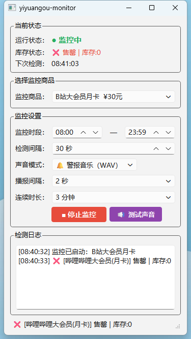

# 一元购库存监控器


监控 vtravel.link2shops.com 一元购平台商品库存，有货时自动提醒。

## 功能特性

- 🔔 **实时监控**：定时轮询商品库存状态
- 🎵 **语音提醒**：支持 WAV 音频或 TTS 语音播报
- 📦 **多商品支持**：B站大会员、优酷VIP、爱奇艺、星巴克、飞客里程券
- ⏰ **时段控制**：可设置监控时间段
- 🎯 **自动停止**：检测到有货后自动停止监控并弹窗提醒
- 📝 **系统托盘**：最小化到托盘后台运行

## 截图



## 安装使用

### 方法一：直接运行（推荐）

1. 下载 [Releases](https://github.com/ly14sh/yiyuangou-monitor/releases) 中的 `一元购库存监控.exe`
2. 双击运行即可，无需安装 Python

### 方法二：源码运行

```bash
# 克隆仓库
git clone https://github.com/ly14sh/yiyuangou-monitor.git
cd yiyuangou-monitor

# 安装依赖
pip install -r requirements.txt

# 运行
python monitor.py
```

## 配置说明

首次运行会自动生成 `config.json` 配置文件：

```json
{
  "start_hour": 8,
  "start_min": 0,
  "end_hour": 23,
  "end_min": 59,
  "interval": 30,
  "alert_text": "一元购有库存啦，快去下单！",
  "selected_id": "bilibili_monthly",
  "sound_mode": "wav",
  "music_interval": 2,
  "music_duration": 3
}
```

| 配置项 | 说明 |
|--------|------|
| `interval` | 监控间隔（秒） |
| `sound_mode` | 播报方式：`wav` 或 `tts` |
| `music_interval` | 播报间隔（秒） |
| `music_duration` | 连续播报时长（分钟） |

## 支持商品

| 商品 | ID | 面值 |
|------|-----|------|
| B站大会员月卡 | bilibili_monthly | ¥30 |
| 优酷VIP会员(月卡) | youku_monthly | ¥30 |
| 飞客2000里程券 | feike_2000 | ¥20 |
| 星巴克43元星礼包 | starbucks_43 | ¥43 |
| 爱奇艺黄金会员(月卡) | iqiyi_gold | - |

## 技术栈

- **GUI**: PySide6
- **HTTP**: requests
- **音频**: PowerShell TTS / WAV
- **打包**: PyInstaller

## 免责声明

本工具仅供学习交流使用，请勿用于商业用途。使用本工具产生的任何后果由使用者自行承担。

## License

MIT License © 2024 ly14sh
